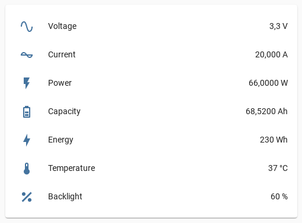

# esphome-atorch-dl24


[](https://www.buymeacoffee.com/syssi)

ESPHome component to monitor and control some Atorch meters via bluetooth




## Supported devices

* Atorch DL24
* Atorch DL24P
* Atorch J7-C requires a disabled CRC check
  ```
  atorch_dl24:
    - id: atorch0
      ble_client_id: ble_client0
      check_crc: false
  ```

## Supported but untested devices

* Atorch AT24
* Atorch AT3010
* Atorch DT24
* Atorch DT3010
* Atorch UD18
* Atorch UD18-L
* Atorch T18
* Atorch J7-H

## Unsupported devices because of a different protocol

* Atorch Q7-T
* Atorch A3-B
* Atorch KM001

## Requirements

* [ESPHome 2022.10.0 or higher](https://github.com/esphome/esphome/releases).
* Generic ESP32 (f.e. ESP32 NodeMCU or D1 Mini ESP32)

## Installation

Use the `esp32-dc-meter-example.yaml` as proof of concept:

```bash
# Install esphome
pip3 install esphome

# Clone this external component
git clone https://github.com/syssi/esphome-atorch-dl24.git
cd esphome-atorch-dl24

# Create a secret.yaml containing some setup specific secrets
cat > secrets.yaml <<EOF
dl24_mac_address: MY_DL24_MAC_ADDRESS

wifi_ssid: MY_WIFI_SSID
wifi_password: MY_WIFI_PASSWORD

mqtt_host: MY_MQTT_HOST
mqtt_username: MY_MQTT_USERNAME
mqtt_password: MY_MQTT_PASSWORD
EOF

# Validate the configuration, create a binary, upload it, and start logs
esphome run esp32-dc-meter-example.yaml

```

## Example response all sensors enabled

```
[D][ble_client:045]: Found device at MAC address [41:B8:12:0A:A8:37]
[I][ble_client:083]: Attempting BLE connection to 41:b8:12:0a:a8:37
[D][ble_client_lambda:060]: Connected to BLE device
[I][ble_client:159]: Service UUID: 0x1800
[I][ble_client:160]:   start_handle: 0x1  end_handle: 0x9
[I][ble_client:339]:  characteristic 0x2A00, handle 0x3, properties 0x2
[I][ble_client:339]:  characteristic 0x2A01, handle 0x5, properties 0x2
[I][ble_client:339]:  characteristic 0x2A02, handle 0x7, properties 0x2
[I][ble_client:339]:  characteristic 0x2A04, handle 0x9, properties 0x2
[I][ble_client:159]: Service UUID: 0xFFE0
[I][ble_client:160]:   start_handle: 0xa  end_handle: 0xf
[I][ble_client:339]:  characteristic 0xFFE1, handle 0xc, properties 0x1c
[D][sensor:118]: 'atorch-dl24 voltage': Sending state 3.30000 V with 1 decimals of accuracy
[D][sensor:118]: 'atorch-dl24 current': Sending state 20.00100 A with 3 decimals of accuracy
[D][sensor:118]: 'atorch-dl24 power': Sending state 66.00330 W with 4 decimals of accuracy
[D][sensor:118]: 'atorch-dl24 capacity': Sending state 61.98000 Ah with 4 decimals of accuracy
[D][sensor:118]: 'atorch-dl24 energy': Sending state 210.00000 Wh with 0 decimals of accuracy
[D][sensor:118]: 'atorch-dl24 temperature': Sending state 37.00000 °C with 0 decimals of accuracy
[D][sensor:125]: 'atorch-dl24 runtime': Sending state 9206.00000 s with 0 decimals of accuracy
[D][text_sensor:067]: 'atorch-dl24 runtime formatted': Sending state '2h 33m 26s'
[D][sensor:118]: 'atorch-dl24 dim backlight': Sending state 60.00000 s with 0 decimals of accuracy
[D][sensor:118]: 'atorch-dl24 voltage': Sending state 3.30000 V with 1 decimals of accuracy
[D][sensor:118]: 'atorch-dl24 current': Sending state 20.00400 A with 3 decimals of accuracy
[D][sensor:118]: 'atorch-dl24 power': Sending state 66.01321 W with 4 decimals of accuracy
[D][sensor:118]: 'atorch-dl24 capacity': Sending state 61.98000 Ah with 4 decimals of accuracy
[D][sensor:118]: 'atorch-dl24 energy': Sending state 210.00000 Wh with 0 decimals of accuracy
[D][sensor:118]: 'atorch-dl24 temperature': Sending state 37.00000 °C with 0 decimals of accuracy
[D][sensor:125]: 'atorch-dl24 runtime': Sending state 9207.00000 s with 0 decimals of accuracy
[D][text_sensor:067]: 'atorch-dl24 runtime formatted': Sending state '2h 33m 27s'
[D][sensor:118]: 'atorch-dl24 dim backlight': Sending state 60.00000 s with 0 decimals of accuracy
[D][sensor:118]: 'atorch-dl24 voltage': Sending state 3.30000 V with 1 decimals of accuracy
[D][sensor:118]: 'atorch-dl24 current': Sending state 19.99600 A with 3 decimals of accuracy
[D][sensor:118]: 'atorch-dl24 power': Sending state 65.98680 W with 4 decimals of accuracy
[D][sensor:118]: 'atorch-dl24 capacity': Sending state 61.99000 Ah with 4 decimals of accuracy
[D][sensor:118]: 'atorch-dl24 energy': Sending state 210.00000 Wh with 0 decimals of accuracy
[D][sensor:118]: 'atorch-dl24 temperature': Sending state 37.00000 °C with 0 decimals of accuracy
[D][sensor:125]: 'atorch-dl24 runtime': Sending state 9208.00000 s with 0 decimals of accuracy
[D][text_sensor:067]: 'atorch-dl24 runtime formatted': Sending state '2h 33m 28s'
[D][sensor:118]: 'atorch-dl24 dim backlight': Sending state 60.00000 s with 0 decimals of accuracy
```

## References

* https://github.com/syssi/esphome-atorch-dl24/blob/main/docs/protocol-design.md
* https://github.com/NiceLabs/atorch-console
* https://auto-scripting.com/2020/05/03/atorch-dl24-hack-1/
